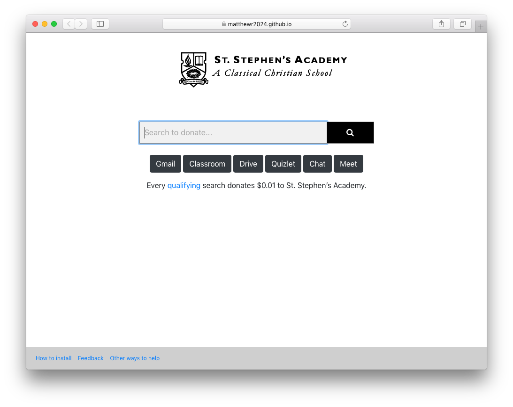

# SSASearch

SSASearch is a Yahoo/GoodSearch powered search engine that donates \$0.01 to [St. Stephen’s Academy on GoodShop](https://www.goodshop.com/nonprofit/st-stephens-academy-beaverton-or) per search.
Visit it here: [https://matthewr2024.github.io/SSASearch/search.html](https://matthewr2024.github.io/SSASearch/search.html)

Version with links to school related sites here: [https://matthewr2024.github.io/SSASearch/newtab.html](https://matthewr2024.github.io/SSASearch/newtab.html)

## Installation Instructions

You can set SSASearch as your New Tab Page. Follow the instructions below for your web browser.

[Safari](https://docs.google.com/document/d/1hvIDYSHsTH5rLBWKoTj2aoFuXK-_38EydX8Ksw2D6Wo/edit?usp=sharing)

[Chrome](https://docs.google.com/document/d/10teHJnUFJI3853n5V-7g2GbNgz9NxHpMvaIMxvF9GKo/edit?usp=sharing)

## Feedback

You can submit feedback on office forms [here](https://bit.ly/SSASearchFeedback) or create a new issue on GitHub [here](https://github.com/matthewr2024/SSASearch/issues).
