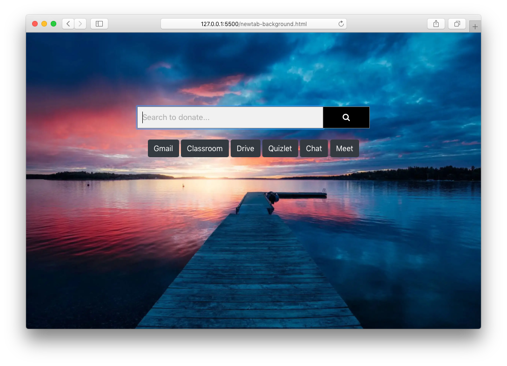

# SSASearch

SSASearch is a Yahoo/GoodSearch powered search engine that donates \$0.01 to [St. Stephen’s Academy on GoodShop](https://www.goodshop.com/nonprofit/st-stephens-academy-beaverton-or) per search.

**Visit it here:** <https://matthewr2024.github.io/SSASearch/search.html>

**Version with links to school related sites here:** <https://matthewr2024.github.io/SSASearch/newtab.html>

**Version with random image background:** <https://matthewr2024.github.io/SSASearch/newtab-background.html>

## Installation Instructions

You can set SSASearch as your New Tab Page. Follow the instructions below for your web browser.

[Safari](https://github.com/matthewr2024/SSASearch/wiki/Safari-Setup)

[Chrome](https://github.com/matthewr2024/SSASearch/wiki/Chrome-Setup)

## Feedback

You can submit feedback on office forms [here](https://bit.ly/SSASearchFeedback) or create a new issue on GitHub [here](https://github.com/matthewr2024/SSASearch/issues).
